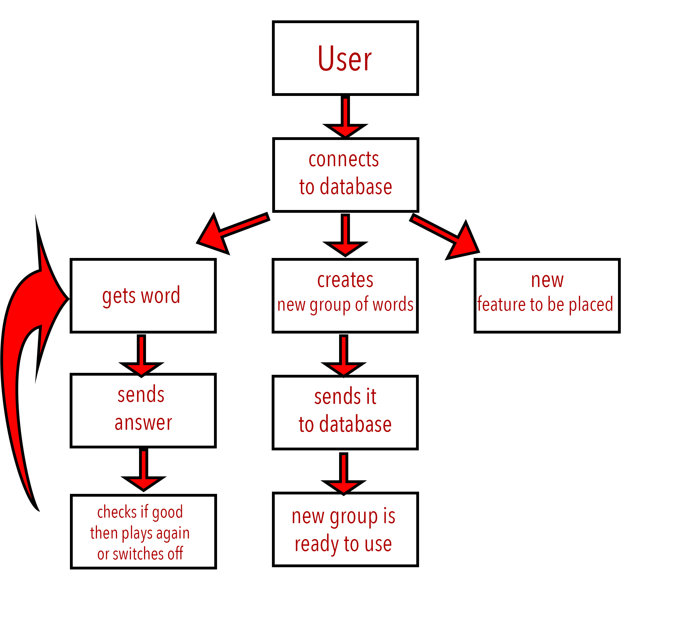

# System design document

# Testing plan

Software Testing Methodology is defined as strategies and testing types used to certify that the Application Under Test meets client expectations. Test Methodologies include functional and non-functional testing to validate the AUT. Examples of Testing Methodologies are Unit Testing, Integration Testing, System Testing, Performance Testing etc. Each testing methodology has a defined test objective, test strategy and deliverables.

++Software Testing Hierarchy
As with almost any technical process, software testing has a prescribed order in which things should be done. The following is a list of software testing categories arranged in chronological order. These are the steps taken to fully test new software in preparation for marketing it:

* Unit testing - testing performed on each module or block of code during development. Unit Testing is normally done by the programmer who writes the code.

* Integration testing - testing done before, during and after integration of a new module into the main software package. This involves testing of each individual code module. One piece of software can contain several modules which are often created by several different programmers. It is crucial to test each module's effect on the entire program model.

* System testing - testing done by a professional testing agent on the completed software product before it is introduced to the market.

* Acceptance testing - beta testing of the product done by the actual end users.

1. Unit Testing:
Unit Testing of software applications is done during the development (coding) of an application.

The objective of Unit Testing is to isolate a section of code and verify its correctness. In procedural programming a unit may be an individual function or procedure

The goal of Unit Testing is to isolate each part of the program and show that the individual parts are correct. Unit Testing is usually performed by the developer.

_Createing Unit Test Cases:
Unit testing is commonly automated, but may still be performed manually. The IEEE does not favor one over the other. A manual approach to unit testing may employ a step-by-step instructional document.

Under the automated approach-

* A developer could write another section of code in the application just to test the function. They would later comment out and finally remove the test code when the application is done.
* They could also isolate the function to test it more rigorously. This is a more thorough unit testing practice that involves copy and pasting the function into its own testing environment to other than its natural environment. Isolating the code helps in revealing unnecessary dependencies between the code being tested and other units or data spaces in the product. These dependencies can then be eliminated.
 

A coder may use a UnitTest Framework to develop automated test cases. Using an automation framework, the developer codes criteria into the test to verify the correctness of the unit. During execution of the test cases, the framework logs those that fail any criterion. Many frameworks will also automatically flag and report in summary these failed test cases. Depending on the severity of a failure, the framework may halt subsequent testing.

_Unit Testing Tools
There are several automated tools available to assist with unit testing. We will provide a few examples below:

Jtest: Parasoft Jtest is an IDE plugin that leverages open-source frameworks (Junit, Mockito, PowerMock, and Spring) with guided and easy one-click actions for creating, scaling, and maintaining unit tests. By automating these time-consuming aspects of unit testing, it frees the developer to focus on business logic and create more meaningful test suites.
Junit: Junit is a free to use testing tool used for Java programming language.  It provides assertions to identify test method. This tool test data first and then inserted in the piece of code.
NUnit:  NUnit is widely used unit-testing framework use for all .net languages.  It is open source tool which allows writing scripts manually. It supports data-driven tests which can run in parallel.
JMockit:  JMockit is open source Unit testing tool.  It is code coverage tool with line and path metrics. It allows mocking API with recording and verification syntax. This tool offers Line coverage, Path Coverage, and Data Coverage.
EMMA:  EMMA is an open-source toolkit for analyzing and reporting code written in Java language. Emma support coverage types like method, line, basic block. It is Java-based so it is without external library dependencies and can access to the source code.
PHPUnit: PHPUnit is a unit testing tool for PHP programmer. It takes small portions of code which is called units and test each of them separately.  The tool also allows developers to use pre-define assertion methods to assert that system behave in a certain manner. 
Those are just a few of the available unit testing tools. There are lots more, especially for C languages and Java, but you are sure to find a unit testing tool for your programming needs regardless of the language you use.

2. Integration Testing:
In integration Testing, individual software modules are integrated logically and tested as a group.

A typical software project consists of multiple software modules, coded by different programmers.

 integration Testing focuses on checking data communication amongst these modules.

Hence it is also termed as 'I & T' (Integration and Testing), 'String Testing' and sometimes 'Thread Testing'.

_Guidelines for Integration Testing
* First determine the Integration Test Strategy that could be adopted and later prepare the test cases and test data accordingly.
* Study the Architecture design of the Application and identify the Critical Modules. These need to be tested on priority.
* Obtain the interface designs from the Architectural team and create test cases to verify all of the interfaces in detail. Interface to database/external hardware/software application must be tested in detail.
* After the test cases, it's the test data which plays the critical role.
* Always have the mock data prepared, prior to executing. Do not select test data while executing the test cases.

3. System Testing
System Testing is the testing of a complete and fully integrated software product. Usually software is only one element of a larger computer based system. Ultimately, software is interfaced with other software/hardware systems.System Testing is actually a series of different tests whose sole purpose is to exercise the full computer based system.

Two Category of Software Testing

* Black Box Testing
* White Box Testing
System test falls under the black box testing category of software testing.
White box testing is the testing of the internal workings or code of a software application. In contrast, black box or System Testing is the opposite. System test involves the external workings of the software from the user's perspective.

_Different Types of System Testing
There are more than 50 types of System Testing. For an exhaustive list of software testing types click here. Below we have listed types of system testing a large software development company would typically use

1_Usability Testing - Usability Testing mainly focuses on the user's ease to use the application, flexibility in handling controls and ability of the system to meet its objectives

2_Load Testing - Load Testing is necessary to know that a software solution will perform under real-life loads.

3_Regression Testing- - Regression Testing involves testing done to make sure none of the changes made over the course of the development process have caused new bugs. It also makes sure no old bugs appear from the addition of new software modules over time.

4_Recovery Testing - Recovery testing is done to demonstrate a software solution is reliable, trustworthy and can successfully recoup from possible crashes.

5_Migration Testing - Migration testing is done to ensure that the software can be moved from older system infrastructures to current system infrastructures without any issues.

6_Functional Testing - Also known as functional completeness testing, Functional Testing involves trying to think of any possible missing functions. Testers might make a list of additional functionalities that a product could have to improve it during functional testing.

7_Hardware/Software Testing - IBM refers to Hardware/Software testing as "HW/SW Testing". This is when the tester focuses his/her attention on the interactions between the hardware and software during system testing.

4. Performance Testing:
Performance Testing is a type of testing to ensure software applications will perform well under their expected workload.

Features and Functionality supported by a software system is not the only concern. A software application's performance like its response time, reliability, resource usage and scalability do matter. The goal of Performance Testing is not to find bugs but to eliminate performance bottlenecks.

The focus of Performance Testing is checking a software program's

-Speed - Determines whether the application responds quickly
-Scalability - Determines maximum user load the software application can handle.
-Stability - Determines if the application is stable under varying loads
-Performance Testing is popularly called as “Perf Testing” and is a subset of performance engineering.

* Types of Performance Testing
-Load testing - checks the application's ability to perform under anticipated user loads. The objective is to identify performance bottlenecks before the software application goes live.

-Stress testing - involves testing an application under extreme workloads to see how it handles high traffic or data processing. The objective is to identify breaking point of an application.

-Endurance testing - is done to make sure the software can handle the expected load over a long period of time.

-Spike testing - tests the software's reaction to sudden large spikes in the load generated by users.

-Volume testing - Under Volume Testing large no. of. Data is populated in database and the overall software system's behavior is monitored. The objective is to check software application's performance under varying database volumes.

-Scalability testing - The objective of scalability testing is to determine the software application's effectiveness in "scaling up" to support an increase in user load. It helps plan capacity addition to your software system.

_Performance Test Tools
There are a wide variety of performance testing tools available in market. The tool you choose for testing will depend on many factors such as types of protocol supported , license cost , hardware requirements , platform support etc. Below is a list of popularly used testing tools.

--NeoLoad - is the performance testing platform designed for DevOps that seamlessly integrates into your existing Continuous Delivery pipeline. With NeoLoad, teams test 10x faster than with traditional tools to meet the new level of requirements across the full Agile software development lifecycle - from component to full system-wide load tests.

--WebLOAD - is a pioneer and leader in load testing, providing rich capabilities for managing large-scale performance tests in complex enterprise environments. Running in the cloud or on-premises, WebLOAD offers advanced scripting, recording, and automated correlation, while allowing organizations to automate load testing for seamless DevOps integration and continuous delivery

--LoadView Testing - Test your infrastructure at any scale. From small targeted tests to millions of users, find performance bottlenecks and adjust your capacity plan accordingly. LoadView offers on-demand, 100% cloud based load testing. Test user experience with real browsers, for a complete performance picture.

--HP LoadRunner - is the most popular performance testing tools on the market today. This tool is capable of simulating hundreds of thousands of users, putting applications under real life loads to determine their behavior under expected loads. Loadrunner features a virtual user generator which simulates the actions of live human users.

--Jmeter - one of the leading tools used for load testing of web and application servers.

# Project plan

1. Game Project
2. Scrum Master : Miklos Kovacs
3. Team Memmbers: Aziz Gasimov , Maksat Baigazy, Miklos Kovacs, Amer Mamoun , Xolani Nhlapon, Rayne Blair, Kaddour Srarfi, Chihep Njr
- Tasks Assigned for members:
1. Project Plan: Aziz Gasimov
2. Testing Plan: Amer Mamoun
3. Database Plan: Maksat Baigazy
4. Functional Plan: Xolani Nhlapon
5. Physical Design: Rayne Blair
6. Business logic model:  Kaddour Srarfi
7. As for OS the product is designed for Windows OS, Mac OS, Linux OS and after publishing the project we will work on mobile environment and 
8. Aziz Gasimov is responsible for Publishing the product on every platform's Application store and on the official web site
9. Deadline for all tasks are the same: 15/12/2018
10. Estimated Budget for the project is 2.000.000 Ft

# Business logic model

# Requirements

In the requirements of the system design document, it is crucial to include the following inorder to a successfull gamification
1. Achievement "badges"
2. Achievement level
3. "leader boards"
4. A progress bar or other visual meter to indicate how close people are to completing a task a company is trying to encourage, such as    completing a social networking profile or earning a frequent shopper loyalty award.
5. Virtual currency
6. Systems for awarding, redeeming, trading, gifting, and otherwise exchanging points
7. Challenges between users embedding small casual games within other activities.

# Functional plan
Developers are constantly learning new tools and processes while accumulating real world experiences to be able to resolve problems quickly and elegantly. The down side is that developers require time to explore and learn the tools available to them by which workplaces tend to discourage as work deadlines are prioritized over experimentation. However, gamification systems incorporated as part of the developer’s familiarization period could save time and enable effective learning. 

Gamification could be utilized as a recognition system for the developers work. Despite the efforts and creativity of the developer in problem solving, there is rarely a place of recognition for their achievements. Thus, the implementation of game mechanics such as an achievement systems and leaderboards would highlight the developer’s progress and accomplishments. For Microsoft’s Visual Studio Achievements, developers can unlock badges and compete against one another based on the code they write, its level of sophistication, and the Visual Studio capabilities they use to do so. It not only displays the achievements accomplished among developers, the leaderboard system spur friendly competition and growth among developers. 

Last but not least, developers would be able to monitor their own progress when gamification systems involving points and level system are employed. When scoring systems are attached to a developer’s progress, it enables a tangible manner to observe both their own growth as well as their fellow team mates. In turn, upper management could then  justify rewarding their best developers with quantifiable data on hand. An example would be Nokia’s DVLUP program which lets developers earn experience points and level up as they build Window’s Phone apps and completing challenges. They could then use their points to redeem rewards available to them such as a Lumia 920 or gift cards. On that end note, while extrinsic rewards can be a powerful motivator for developers, it should be noted that it has its shortcomings as well and should not be overused.

These recent developments illustrates that gamification can be compliment in boosting developers and the industry. Gamification not only accelerates the learning process of the tools used by developers, it acts as a archival system in  recognizing their achievements and progress. Furthermore, gamification’s social nature indirectly encourages developers to socialize and collaborate amongst themselves in their field work. For decision makers, gamification systems could potentially yield rich unforeseen data patterns that would benefit them in their decision making process. Thus, for aspiring enterprises who wish to use gamification system for such purposes, it is imperative to customize their systems to make it easier and more enjoyable for developers to do what they do best, solving problems

# Logical design

# Physical Design
The Physical Design is a complete implementation design or blueprint, in the form of a technical specification that the development team will use to build the solution. Program Management is responsible for ensuring that the physical design document is completed. The project will be developed for PC users using Windows. The project will be developed using Visual Studio Community. To share our progress we will be using GitHub to maintain the code and Trello to keep track of tasks and deadlines. 

Environment Constraints and Assumptions:
We will be using Visual Studio Community for our IDE, a powerful tool. The only constraints VSC has are its slower loading times and functionality, and its inferior auto-formatting compared to some other IDEs. 

Dependencies:
The physical design will depend on the size and resolutions of the images we are using as well as the wireframes developed by our team. Each screen of the application will need to hold 4 images as well as some text explaining the exercises. 

Multi-Language Support:
Due to time constraints we will not be working on multi-language support. Given more time and resources we could develope support for a couple other languages. 

# Database plan

We need to have a database for our project, at least 4 tables: Users, Data, User_role, Topic tables for app use.
In user table we will have 4 columns:

1. id (int, AI)
2. username (varchar, unique)
3. password (varchar)
4. email (varchar, unique)
5. user_role (foreign key: user_role.id)

This is our main table for login and registration, it requires to be filled 3 columns: Username, which should not be same as someone's else, password to have an acces to your account and email, maybe for future verification feature and for updates and notifications. Without loggining the user has no permission to use our app. Most probable user has to agree for terms of use (of his bank card. HAHA).

Data table:

1. id (int, AI)
2. Datasource (varchar)
3. topic_id (foreign key: topic.id)
4. users_name (foreign key: users.id)

This table has a big role in our project. Because through it user going to get Images (or videos) for further use of application. It will contain link of the data, Topic name of image from topic table and users_id if the image was made or uploaded by user.

Topic (of Data)

1. id (int, AI)
2. topicname(varchar, unique)

Topic table contains different names of topic. Each image must have a topic to be used in game and one image can have only one topic name. The table is made for users to know in what arrea they are going to play, and they (maybe) can choose the topic to be played.

User_role table:

1. id (int, AI)
2. role_description (varchar)

User role table is for dividing users to different roles. For example in our application users most probably going to have two different accounts: First one for simple users, and second one, which is really important one for us(developers) is VIP account, which gives you more different features and possibilities.
Of course to get VIP account user has to pay small amount of money ($10).

# Update plan 🖥
As it is a *web based application*, the rollout of the updates **might** result in *temporary downtime*. The two exact scenarios are the following:
- In case, **we have *High Availability*** system, the updates can be rolled out to the servers one by one, meaning absolutely *no downtime*.
- In case, **we do not have *HA* system**, the server must *disconnect* any *logged in users* and should *not allow new connections*. Then the update can be applied on the server, finally the server can be set again to allow connections.

Updates should happen **every month**, applying new requirements from every side. The exact time for the update should be the *11th day of every month*, at *03:20*, as it seems to be the time, when the system would be used the least.

It is a **must**, that we make a *backup* before an update happens. The backup should be a **full database, and filesystem backup 💾**. The automation of this sys is *recommended*.

The *update development* should happen on a *scaled down version of the live server*, the **tesing of the update should begin on the 5th day of every month**. Before that, on the 4th of every month, a *database cloning* should happen from the live server **to the test server**.

